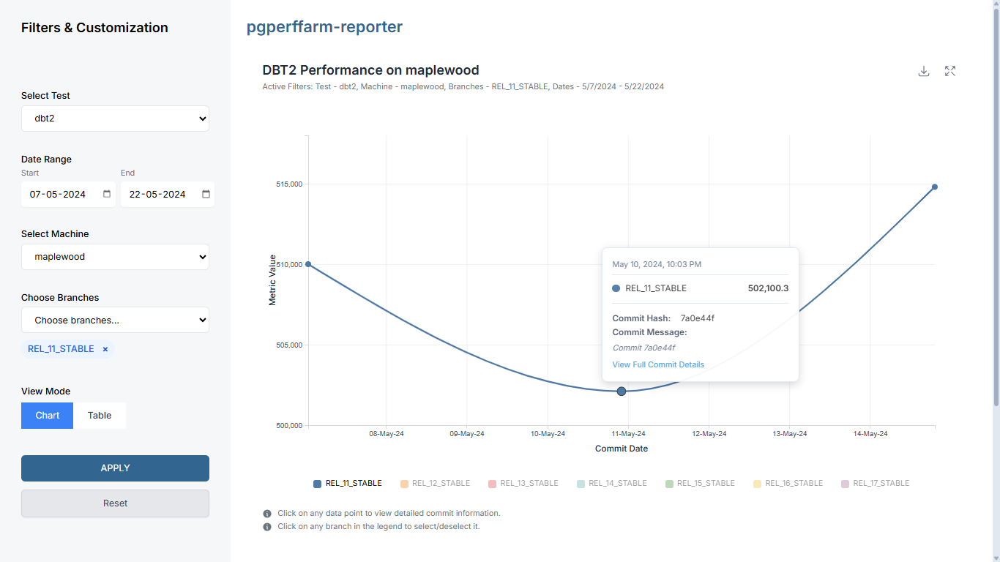
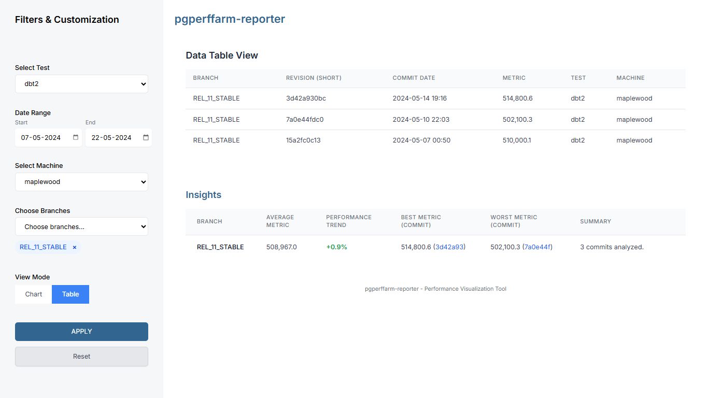

# 📊 pgperffarm-reporter

**A modern frontend interface for the PostgreSQL Performance Farm.**  
This tool allows developers, DBAs, and PostgreSQL contributors to visualize performance benchmarks over time — directly from collected test data.

---




## 🔍 What is this?

`pgperffarm-reporter` is a web-based performance visualizer that transforms raw benchmark data into interactive insights. It’s built as a **static frontend prototype** to demonstrate how PostgreSQL performance metrics can be explored via charts, filters, and structured tables.

The project was developed in alignment with the **PostgreSQL Performance Farm**, using a simulated API.

---

## 🎯 Key Features

- **📊 Interactive Line Chart:**  
  Plot performance metrics across commits, comparing multiple branches.

- **🧠 Smart Filter Panel:**  
  Dynamically adjust by test name, machine, branch, and date range.

- **📋 Insights Table:**  
  Summarizes average performance, best/worst commits, and percentage deltas.

- **🔗 Commit Details Tooltips:**  
  Commit hash, message, and date visible on hover for each data point.

---

## 🖼️ UI Design Philosophy

The UI is designed to feel like a **PostgreSQL-native analytics tool**:

- Uses **PostgreSQL Blue (#336791)** as the primary accent color.
- **No bloated UI**: It reflects a clean, technical dashboard feel.
- Typography is professional and minimal (Inter/Default sans-serif fallback).
- Dashboard layout is fully **responsive**, using Tailwind CSS.

### Why These Components?

- **Line Chart View**: Ideal for identifying performance regressions or improvements over time.
- **Filters Panel**: Mimics backend-driven workflows where filters guide query-specific data.
- **Insights Table**: Offers quick glance into trends and outliers — very relevant to developers/DBAs during benchmarking.

---

## 🚀 Live Preview

> 🔗 [Live Demo](https://bhaweshpanwar.github.io/perffram-reporter/)  
> 📦 [Simulated Data Source (JSON)](https://api.jsonbin.io/v3/b/682db9578960c979a59e6fa7)

---

## 📂 Data Format

The app expects JSON formatted data with the following structure:

```json
{
  "branch": "REL_17_STABLE",
  "revision": "abc123def456...",
  "scale": "100",
  "ctime": "1715023200",
  "metric": "600000",
  "complete_at": "1715026800",
  "test": "dbt2",
  "machine": "vanillaleaf"
}
```

---

## 🧩 Tech Stack

| Technology                                      | Role                        |
| ----------------------------------------------- | --------------------------- |
| **HTML**                                        | Core layout                 |
| **CSS**                                         | Minor adjustments           |
| **Tailwind CSS**                                | Utility-first design system |
| **JavaScript (Vanilla)**                        | UI logic, state handling    |
| **D3.js**                                       | Data visualization          |
| **Fetch API**                                   | Consuming external data     |
| _(Optional backend stub simulated via JSONBin)_ |

---

## 📂 Project Structure

```bash
PGPERFFARM-REPORTER/
├── index.html              # Landing/Home page
├── Visualizer.html         # Full chart interface
├── chart.png               # Screenshot of chart
├── table.png               # Screenshot of insights table
├── README.md               # This file
```
